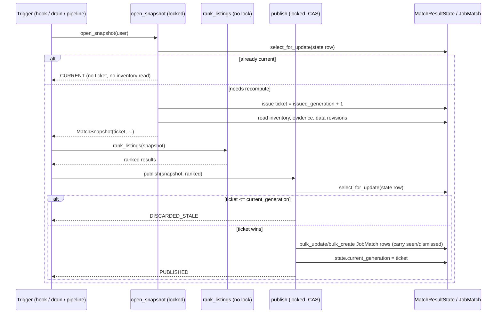

<!-- Copyright (c) 2024 Isaac Adams -->
<!-- Licensed under the MIT License. See LICENSE file in the project root for full license information. -->

# Versioned Job-Match Recomputation (issue #475)

**Status:** implemented, both capability switches default off.

## Goal

Each user gets one committed, versioned job-match result set (a
"generation"). It is recomputed promptly after a committed preference
change and reliably after committed accepted-data changes, using the
inventory already in the database — no crawling needed. Older runs can
never overwrite a newer committed generation. Seen/dismissed state survives
every recompute and version bump. The page and the assistant read the same
committed generation, carrying a generation id and a `generated_at`
timestamp.

## Flow: snapshot -> compute -> CAS publish



Every snapshot for a user takes the same `MatchResultState` row lock, so
snapshots are totally ordered: **ticket order equals preference order
equals data order**. An older run that snapshots first but publishes last
loses the compare-and-swap (`DISCARDED_STALE`) — it can never overwrite a
newer committed generation.

## Triggers

- **Preference fast path** — `PREFERENCE_RECOMPUTE_HOOK` defaults to
  `crank.services.match_recompute.on_preference_committed`, fired by the
  #466 `_schedule_recompute` seam via `transaction.on_commit` after a
  committed `apply_patch_to_user`, `undo_preference_change`, or `reset`.
  Runs inline when `recompute_enabled()` is true (`MATCH_RECOMPUTE_ENABLED`
  + the `match_recompute` switch). The #466 `_fire` wrapper logs and
  swallows any exception, so preference saves never depend on this
  succeeding.
- **Drain** — `manage.py recompute_matches`, an `AgentRunCommand`
  (`run_type=match_recompute`), processes `pending_users(MATCH_RECOMPUTE_MAX_USERS)`
  until `MATCH_RECOMPUTE_DEADLINE_SECONDS`. `--dry-run` prints pending
  counts by tier and exits before claiming a run (no `AgentRun` row is
  created).
- **Pipeline** — `run_job_pipeline`'s `_run_user` calls `recompute_user`
  directly. Not gated by the new switches — it fixes the existing,
  already-enabled `job_pipeline` capability (mis-stamped revisions and
  overwrite races in the pre-#475 `persist_matches` upsert path).

## Dirtiness (no request queue)

`pending_users(limit)` derives dirtiness from durable state, so N committed
events for one user collapse into exactly one recompute:

1. **Preference-dirty** (oldest `UserPreference.modified` first): no state
   row, no current generation, or the preference revision/schema version
   differs from the state's stamped tags.
2. **Generation-dirty** (oldest `generated_at` first): stale ranker version,
   the data watermark (`publication.data_watermark()`) has advanced past
   the state's `data_revision`, the generation is older than
   `MATCH_RECOMPUTE_MAX_AGE_HOURS`, or a ticket was issued but never
   published (`issued_generation > current_generation` — an interrupted or
   failed run, retried without a separate error queue).

The `UserPreference` row itself is the durable "request": a committed save
can never be lost even if the fast path crashes, because the drain will
eventually find it preference-dirty.

## Watermark gap (G8)

`PublicationEvent.id` is allocated at insert; commits can land out of id
order under concurrent writers. A max-id watermark can therefore miss an
event whose id is lower but which commits after a snapshot already read a
higher id. Writers commit within milliseconds of inserting
(`crank/services/scores.py`, `crank/services/job_ingest.py`), so the next
event or the age backstop (`MATCH_RECOMPUTE_MAX_AGE_HOURS`, 0 disables it)
bounds the gap. This is documented residual risk, not a correctness bug.

## Reads

`crank.services.match_results` (gated by `MATCH_RESULTS_READ_ENABLED` +
`match_results_read`) serves the current committed generation to:
`GET /api/job-matches/ranked/`, `GET /api/job-matches/`,
`GET /api/job-matches/status/` (the empty-state count), and the assistant's
`get_matches_for_user`. Every surface reads through
`current_generation_queryset`/`current_job_results`, so they see one
identical `revision` block. With the gate off, or before any generation has
been published for a user, every surface falls back to today's live
computation unchanged — pre-rollout users and the `seed_e2e` Playwright
journey keep working. Injected `match_service` calls (this-search-only
preference overrides, orchestrator injections) always stay live.

## Rollout order

1. Migrate `0039_match_result_generation` — additive; old pods ignore the
   new table/column.
2. Deploy the code. The job pipeline now publishes generations through CAS
   whenever it runs, while `match_recompute` and `match_results_read` stay
   off. Reads are unchanged; the hook no-ops because it is gated.
3. Enable `MATCH_RECOMPUTE_ENABLED` (plus `AGENT_RUN_ENABLED`) and
   unsuspend `crank-match-recompute`. The drain bootstraps generations for
   every preference row, preference-dirty tier first. The fast path
   activates on web pods.
4. Verify `manage.py recompute_matches --dry-run` reports 0 preference-dirty
   users and spot-check a few generations. Then enable
   `MATCH_RESULTS_READ_ENABLED`.

Keep the job pipeline's CronJob suspended during the deploy window (default);
its `concurrencyPolicy: Forbid` prevents overlap either way.

## Rollback

Turn off `match_results_read` to return every surface to live reads. Turn
off `match_recompute` to stop the hook and the drain. Setting
`PREFERENCE_RECOMPUTE_HOOK=""` removes only the inline fast-path cost (the
drain remains, if enabled). No records are deleted; the migration is
forward-only and additive.

## Verification

```bash
python manage.py recompute_matches --dry-run
python manage.py rollback_drill --json   # match_recompute / match_results_read both block with the switch off
```
