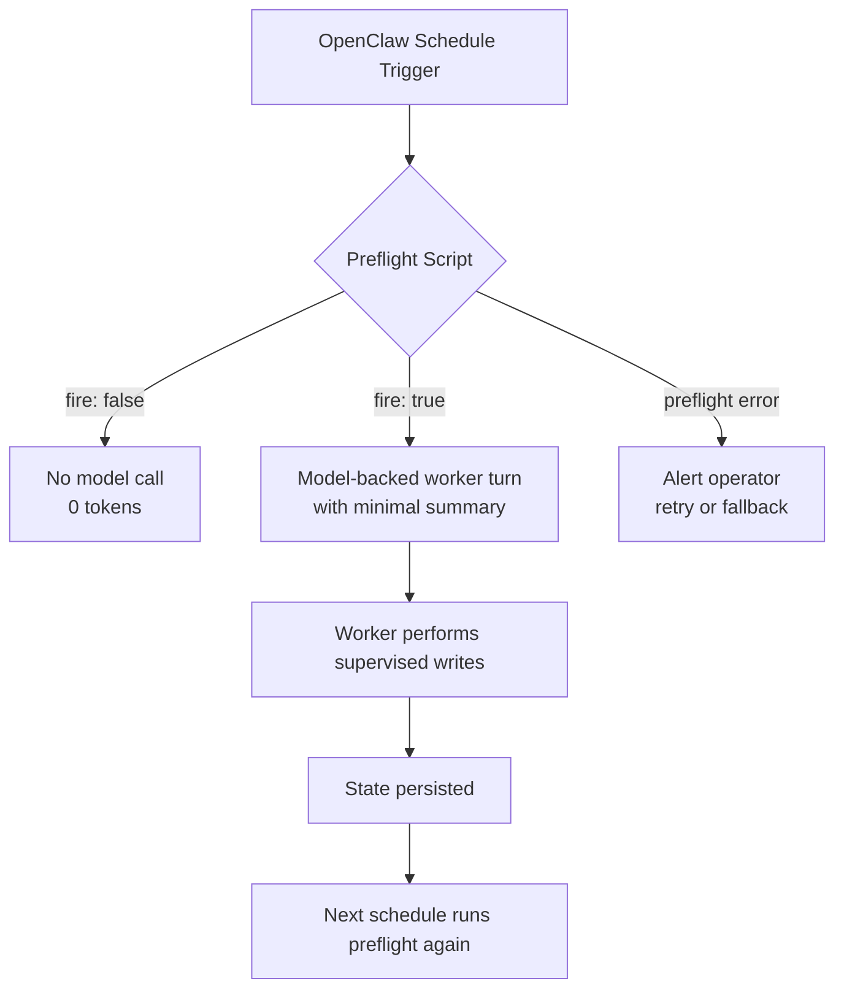

# Copyright (c) 2024 Isaac Adams
# Licensed under the MIT License. See LICENSE file in the project root for full license information.
# Operator Runbook: OpenClaw Maintenance Job Preflights

## Overview

This runbook covers the deterministic preflight scripts added in issue #444
to gate OpenClaw maintenance jobs (`crank-pr-ci-conflict-convergence` and
`sf-watchdog`). The prefights replace fixed-interval model-backed turns
with read-only, deterministic checks that return `{fire: false}` when no
actionable work exists, eliminating idle LLM token consumption.

## Architecture



### PR Convergence Preflight

**Script:** `preflights/pr_convergence.py`
**Job:** `crank-pr-ci-conflict-convergence` (every 15 min)

Inspects open managed PRs (labeled `sf-managed`, `factory`, or
`auto-merge`) on the target repo. Computes a fingerprint from:

- PR numbers and head SHAs
- Mergeability/conflict state
- Required-check state at head
- Unresolved review gates (changes requested)
- Merge/readiness labels (`blocked`, `do-not-merge`)

**Fire conditions:**
- At least one managed PR with an actionable state (conflict, failing
  checks, changes requested, blocked label) AND the fingerprint changed
  since the last run.

**No-fire conditions:**
- No open managed PRs
- All managed PRs are clean/approved/passing
- Same actionable fingerprint as last run (deduplication)

### Watchdog Preflight

**Script:** `preflights/watchdog.py`
**Job:** `sf-watchdog` (every 30 min)

Runs deterministic audits:

- GitHub Actions workflow run failures (last 20 runs)
- Django system check warnings
- Stale PR audit (open PRs with no activity > 3 days)

**Fire conditions:**
- Any `warn` or `error` severity finding AND the fingerprint changed
  since the last run.

**No-fire conditions:**
- No `warn`/`error` findings
- Same findings fingerprint as last run (deduplication)

## State Persistence

Each preflight persists a bounded, non-secret JSON state file under
`.preflight-state/`:

```
.preflight-state/
├── pr-convergence.json   # {"fingerprint": "...", "summary": {...}, "updated_at": 123}
└── watchdog.json         # {"fingerprint": "...", "summary": {...}, "updated_at": 123}
```

State files contain only:
- A 16-character SHA-256 fingerprint prefix
- A minimal summary (PR count or finding count)
- A Unix timestamp

**No secrets, tokens, or detailed PR data are stored.**

The state directory can be overridden with the `PREFLIGHT_STATE_DIR`
environment variable.

## OpenClaw Job Migration

### Before (current)

Both jobs are scheduled OpenClaw maintenance jobs that start a
model-backed isolated turn on every interval:

```yaml
# crank-pr-ci-conflict-convergence
schedule: "*/15 * * * *"
type: model
command: "Check PR convergence for norcalipa/crank..."

# sf-watchdog
schedule: "*/30 * * * *"
type: model
command: "Run watchdog audits..."
```

**Idle token consumption per run:**
- PR convergence: ~170k–1.25M tokens
- Watchdog: ~90k tokens

### After (target)

Both jobs use trigger scripts that return `{fire: false}` to skip the
model call, or `{fire: true}` with a minimal summary for the worker:

```yaml
# crank-pr-ci-conflict-convergence
schedule: "*/15 * * * *"
type: trigger
script: "python preflights/pr_convergence.py"
env:
  GITHUB_REPOSITORY: "norcalipa/crank"
  PREFLIGHT_STATE_DIR: "/data/preflight-state"
# When fire: true, OpenClaw starts a model-backed turn with the
# summary as context and restricted tools (read-only GitHub).

# sf-watchdog
schedule: "*/30 * * * *"
type: trigger
script: "python preflights/watchdog.py"
env:
  GITHUB_REPOSITORY: "norcalipa/crank"
  PREFLIGHT_STATE_DIR: "/data/preflight-state"
```

**OpenClaw config lives outside this repo.** The above is a reference
for the operator. The actual config is applied through the OpenClaw
gateway configuration.

### Estimated Daily Token/Cost Reduction

Assuming 24h unchanged-state soak (the normal idle case):

| Job | Interval | Runs/day | Idle tokens/run | Idle tokens/day | Post-change tokens/day | Reduction |
|-----|----------|----------|-----------------|-----------------|----------------------|-----------|
| PR convergence | 15 min | 96 | ~170k–1.25M | ~16M–120M | 0 | 100% |
| Watchdog | 30 min | 48 | ~90k | ~4.3M | 0 | 100% |
| **Total** | | **144** | | **~20M–124M** | **0** | **100%** |

When actionable state exists, the preflight fires once per new
fingerprint, passing a minimal summary (~1–5k tokens) instead of the
full context the model would otherwise gather (~90k–1.25M tokens).

## Install

1. Ensure the `gh` CLI is installed and authenticated:
   ```bash
   gh auth status
   ```

2. Ensure Python 3.11+ is available.

3. Clone or update the repo:
   ```bash
   git clone https://github.com/norcalipa/crank.git
   cd crank
   ```

4. Create the state directory:
   ```bash
   mkdir -p .preflight-state
   # Or set a custom path:
   export PREFLIGHT_STATE_DIR=/data/preflight-state
   ```

5. Configure OpenClaw job triggers (see "After" config above) through
   the OpenClaw gateway configuration.

## Update

1. Pull the latest repo:
   ```bash
   git pull origin main
   ```

2. Run the test suite to verify preflight scripts:
   ```bash
   pytest crank/tests/preflights/ -v
   ```

3. Run a manual preflight to verify (see "Manual Run" below).

4. No state reset needed — existing fingerprints remain valid.

## Rollback

To revert to the previous fixed-interval model-backed schedule:

1. Update the OpenClaw job config to remove the trigger script and
   restore the `type: model` configuration.

2. Optionally remove the state directory:
   ```bash
   rm -rf .preflight-state/
   ```

3. The previous schedule resumes on the next interval.

Rollback is safe because the preflight scripts are read-only and do
not modify any GitHub state. The state files are disposable.

## State Reset

To force the preflight to re-fire on the next run (e.g., after
investigating an issue):

```bash
# Reset PR convergence state
rm .preflight-state/pr-convergence.json

# Reset watchdog state
rm .preflight-state/watchdog.json

# Or reset all
rm -rf .preflight-state/
```

The next preflight run will treat all state as new and fire if
actionable conditions exist.

## Manual Run

Run a preflight manually to verify behavior:

```bash
# PR convergence
GITHUB_REPOSITORY=norcalipa/crank python preflights/pr_convergence.py

# Watchdog
GITHUB_REPOSITORY=norcalipa/crank python preflights/watchdog.py
```

Output is JSON on stdout:
```json
{"fire": false, "reason": "no_managed_prs", "summary": {}, "fingerprint": null, "error": null}
```

Exit codes:
- `0` — success (fire or no-fire)
- `2` — unexpected error
- `3` — rate limit
- `4` — timeout
- `5` — API error

## Verification

After installation, verify the prefights are working:

1. **No-work verification:** Run the preflight with no actionable state.
   Confirm `{fire: false}` output and exit code 0.

2. **Actionable verification:** Create a test PR with a conflict or
   failing check. Run the preflight. Confirm `{fire: true}` and a
   non-empty summary.

3. **Deduplication verification:** Run the preflight again with the same
   state. Confirm `{fire: false}` with reason `unchanged_*`.

4. **State reset verification:** Delete the state file and re-run.
   Confirm `{fire: true}` if actionable state still exists.

5. **24-hour soak:** Leave the schedule running with no state changes.
   Confirm zero model-backed runs in OpenClaw logs.

## Error Handling

| Error | Exit Code | Behavior |
|-------|-----------|----------|
| Rate limit | 3 | Preflight returns `{fire: false, error: "RateLimitError: ..."}`. OpenClaw should retry on next interval. |
| Timeout | 4 | Preflight returns `{fire: false, error: "TimeoutError: ..."}`. Check `gh` CLI health. |
| API error | 5 | Preflight returns `{fire: false, error: "APIError: ..."}`. Check `gh auth` and repo access. |
| Unexpected | 2 | Preflight returns `{fire: false, error: "..."}`. Investigate and file an issue. |

### Alerting

A broken preflight cannot silently disable maintenance because:

1. Non-zero exit codes are visible in OpenClaw job logs.
2. OpenClaw should be configured to alert on non-zero exit codes
   (distinct from `{fire: false}` with exit 0).
3. The state file includes an `updated_at` timestamp. An operator can
   monitor for stale state files (no update in >1h during business
   hours) as a secondary signal.
4. Rollback to the previous schedule is documented above and takes
   effect on the next interval.

## Safety Constraints

- **Read-only:** Preflight scripts make no writes to GitHub. All writes
  (merges, rebases, comments) remain in the supervised worker path.
- **Repo-scoped:** Scripts only inspect the target repo specified by
  `GITHUB_REPOSITORY`.
- **Time-bounded:** All `gh` subprocess calls have a 30s timeout.
- **Secret-safe:** No secrets are stored in state files. The `gh` CLI
  uses its own credential store.
- **Bounded state:** State files are small JSON (<1KB each) with only
  a fingerprint, minimal summary, and timestamp.
- **Owner/repo boundary:** Scripts respect the `GITHUB_REPOSITORY`
  env var and only access that repo.
